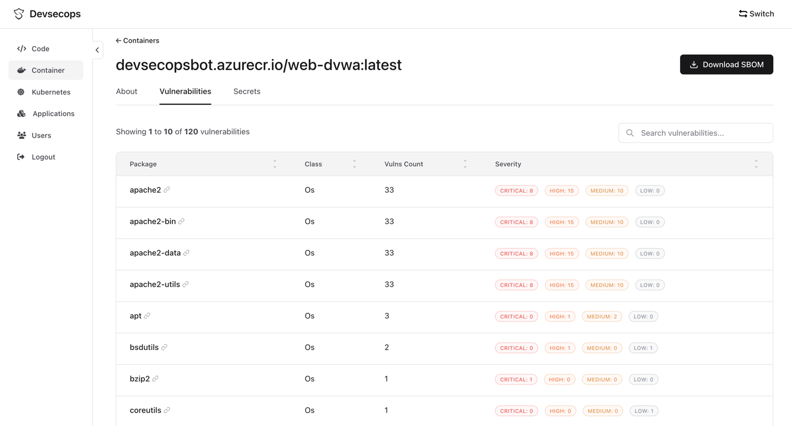
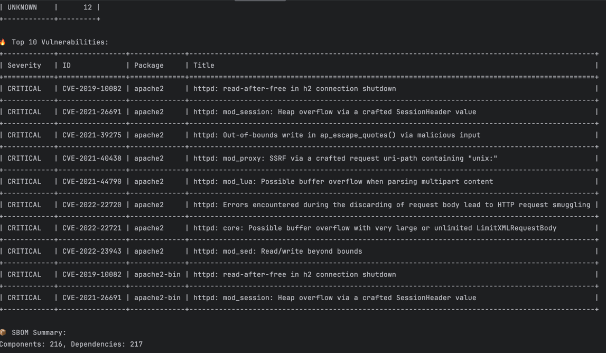

# DevSecOpsBot Image Scanner

A GitHub Action that scans container images for **vulnerabilities** and **secrets**. Includes built-in **blocking policies**, **CI/CD integration**, and optional reporting to the [DevSecOpsBot dashboard](https://devsecops.bot).

---

## 🚀 Features

* 🔍 Scan container images for **vulnerabilities** and **secrets**
* 🛠️ Works in **GitHub Actions CI** and **locally** with `scanner.py`
* 🛡️ Flexible **blocking policies**: block on critical, high+critical, any vulnerability, or secrets
* ☁️ Supports multiple registry providers: **AWS ECR, GCP Artifact Registry, Azure ACR, Docker Hub, generic private registries**
* 📦 Produces both **tabular CLI output** and **structured JSON** for backend ingestion
* 🧾 Detects CI context and attaches **GitHub metadata** to scan results
* 📤 Optionally **POST results** to a backend for dashboards and audit trails

---

## 📊 Dashboard



Sign up at [https://devsecops.bot](https://devsecops.bot) to get your **free token** and send results to the backend dashboard.

---

## 📦 Usage

### GitHub Actions workflow

```yaml
name: Image Scan

on:
  workflow_dispatch:
    inputs:
      image:
        description: "Image to scan"
        required: true
        default: "nginx:latest"

jobs:
  scan:
    runs-on: ubuntu-latest
    steps:
      - uses: devsecopsbot/image-scan@v1
        with:
          image: ${{ github.event.inputs.image }}
          post-url: ${{ secrets.POST_URL }}
          auth-token: ${{ secrets.AUTH_TOKEN }}
          block-on-critical: 0
          block-on-high: 10
          block-on-any: false
          block-on-secrets: true
```

### Local usage

```bash
# Scan an image locally
python scanner.py nginx:latest

# Block if any critical vulnerabilities exist
BLOCK_ON_CRITICAL=0 python scanner.py nginx:latest

# Send results to backend
POST_URL=https://api.devsecops.bot AUTH_TOKEN=yourtoken python scanner.py myimage:tag
```

---

## 🔧 Configuration

### Backend

* `post-url` (input) – backend endpoint (e.g., `https://api.devsecops.bot/api/scan`)
* `auth-token` (input) – backend auth token (obtain from [devsecops.bot](https://devsecops.bot))

### Blocking Policies (Inputs)

* `block-on-critical` – block if critical vulns exceed threshold (e.g., `0`)
* `block-on-high` – block if high+critical vulns exceed threshold (e.g., `10`)
* `block-on-any` – block if *any* vulnerability exists (`true/false`)
* `block-on-secrets` – block if any secrets are detected (`true/false`)

> **Note:** When running locally, blocking can also be set with environment variables (`BLOCK_ON_CRITICAL`, etc.). Inside GitHub Actions, you should configure these as **inputs** when calling the Action.

### Registry Options (Environment Variables)

* `REGISTRY_TOKEN` – token for registry auth
* `REGISTRY_USERNAME`, `REGISTRY_PASSWORD` – generic registry credentials
* `REGISTRY_AZURE_USERNAME`, `REGISTRY_AZURE_PASSWORD` – Azure registry credentials
* `BASE64_GOOGLE_CREDENTIALS` – base64-encoded Google service account JSON
* `AWS_ACCESS_KEY_ID`, `AWS_SECRET_ACCESS_KEY`, `AWS_REGION` – AWS IAM credentials for ECR

---

## ☁️ Cloud Registries

### AWS Elastic Container Registry (ECR)

Authenticate using IAM credentials or roles:

```bash
export AWS_ACCESS_KEY_ID=xxxx
export AWS_SECRET_ACCESS_KEY=yyyy
export AWS_REGION=us-east-1
python scanner.py <aws_account_id>.dkr.ecr.us-east-1.amazonaws.com/myimage:tag
```

### Google Artifact Registry / GCR

Provide service account JSON encoded as base64:

```bash
export BASE64_GOOGLE_CREDENTIALS=$(cat key.json | base64)
python scanner.py gcr.io/myproject/myimage:tag
```

### Azure Container Registry (ACR)

Use registry-specific username/password:

```bash
export REGISTRY_AZURE_USERNAME=<username>
export REGISTRY_AZURE_PASSWORD=<password>
python scanner.py myregistry.azurecr.io/myimage:tag
```

---

## 📤 Output

### Console Output

* 🔐 Secrets found
* 🛡️ Vulnerability summary (counts by severity)
* 🔥 Top 10 vulnerabilities
* 📦 SBOM summary (components, dependencies)

### Backend Output (if configured)

```json
{
  "image_uri": "nginx:latest",
  "source": "CI",
  "source_info": {
    "provider": "github",
    "repo_full_name": "devsecopsbot/image-scan",
    "workflow": "Image Scan",
    "run_id": "123456",
    "run_number": "42"
  },
  "scan_output": {
    "report": { ... },
    "sbom": { ... }
  }
}
```

---

## 🛡️ Blocking Behavior

The Action **exits with code 1** if any configured blocking policy is triggered, failing the job.

Examples:

* `block-on-critical: 0` → fail if *any* critical vuln exists
* `block-on-high: 5` → fail if more than 5 high+critical vulns
* `block-on-any: true` → fail if any vuln exists
* `block-on-secrets: true` → fail if any secrets found

---

## 📖 Examples

### Fail build on any vulnerability

```yaml
with:
  block-on-any: true
```

### Fail build if >5 high/critical vulns

```yaml
with:
  block-on-high: 5
```

### Upload results to backend

```yaml
with:
  post-url: https://api.devsecops.bot/api/scan
  auth-token: ${{ secrets.AUTH_TOKEN }}
```

---

## 📑 Without Backend (Tabular Console Mode)

If `post-url` and `auth-token` are not set, the scanner prints results in tabular format to the console:



Useful for local testing and debugging without backend integration.

---
